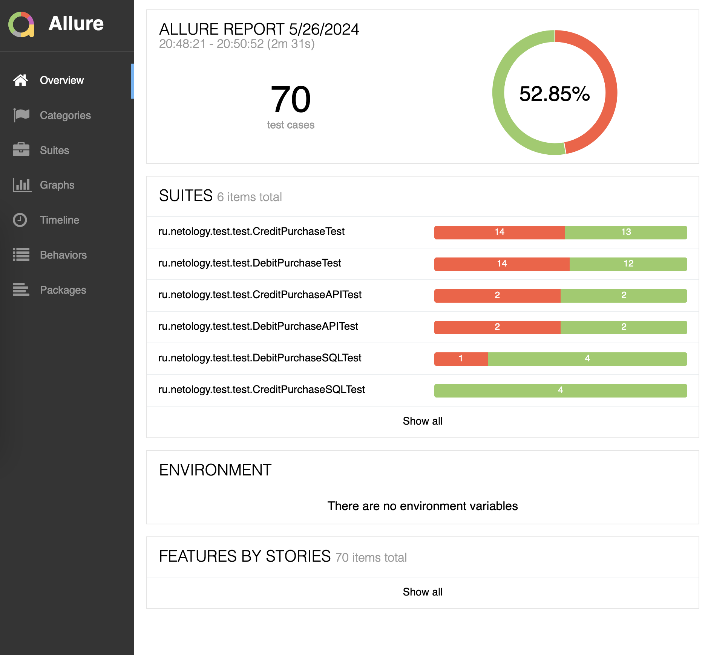
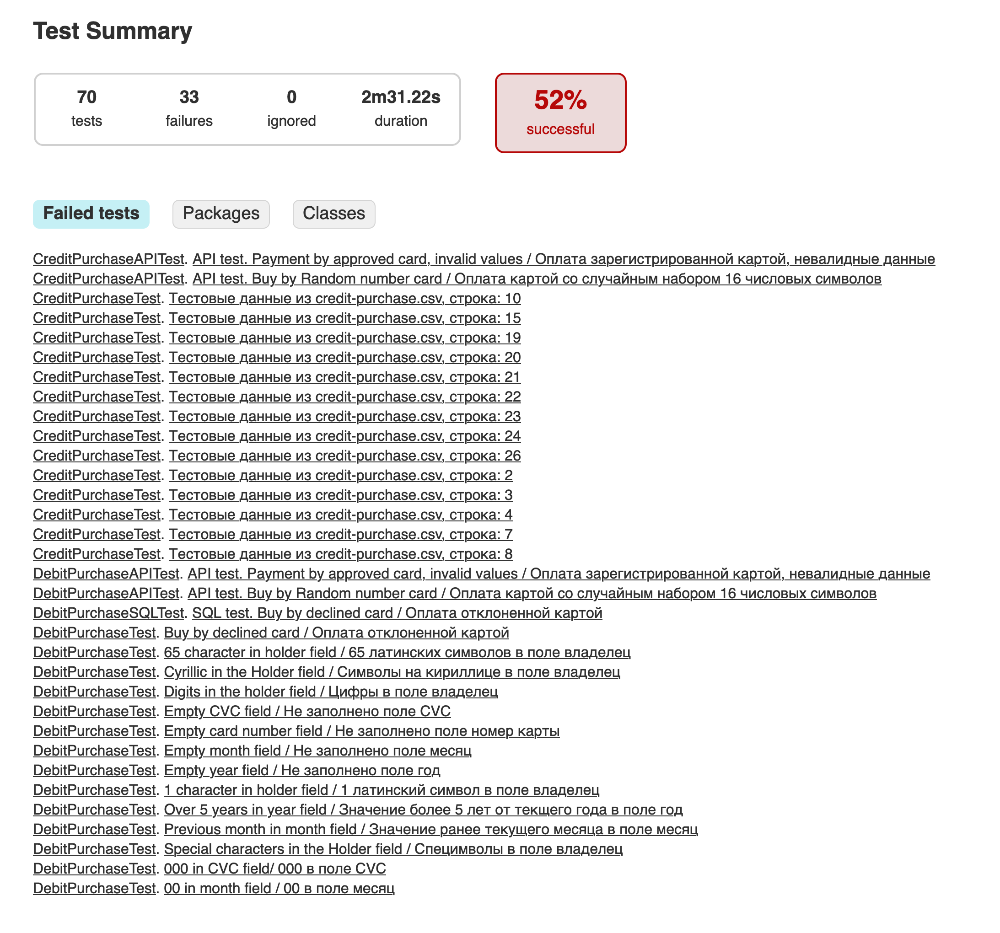

# Отчет о тестировании

В соответствии с тест-планом проведена автоматизация тестирования приложения "Путешествие дня", которое предлагает купить тур картой или в кредит.
Тестирование проведено в двух базах: MySQL и PostgreSQL.
Оформлено 12 issue.
6 тест-сьютов для тестирования:

1. Автоматизированные тесты для формы "Оплата по карте" (26 тестов) DebitPurchaseTest;
2. Автоматизированные API-тесты для формы "Оплата по карте" (4 теста) DebitPurchaseAPITest;
3. Автоматизированные тесты БД через SQL-запросы (5 тестов) DebitPurchaseSQLTestSQL;
4. Автоматизированные тесты для формы "Кредит по данным карты" (27 тестов) CreditPurchaseTest;
5. Автоматизированные API-тесты для формы "Кредит по данным карты" (4 теста) CreditPurchaseAPITest;
6. Автоматизированные тесты БД через SQL-запросы (4 теста) CreditPurchaseSQLTestSQL.

Итого 70 тестов, из них 52% успешных

## Общие рекомендации:

- Предоставить инструкции по настройке окружения.
- Предоставить техническую документацию приложения.

RT
